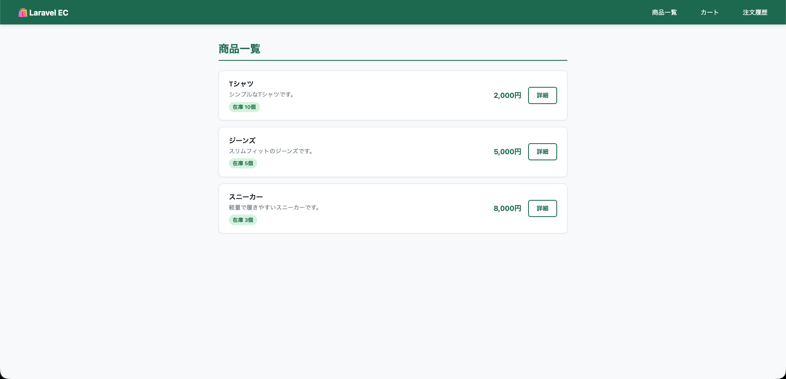

# Laravel EC

Laravel 12 で作成した学習用の簡易ECサイトです。TDD（テスト駆動開発）で実装しました。

## スクリーンショット



## 機能

- 商品一覧・詳細表示
- カートへの追加・削除
- 注文確定・注文履歴

## 技術スタック

- PHP 8.x
- Laravel 12
- MySQL
- PHPUnit（Feature Test）

## セットアップ

```bash
git clone <repository-url>
cd laravel-ec

composer install
cp .env.example .env
php artisan key:generate
```

`.env` のDB設定を編集してから：

```bash
php artisan migrate
php artisan db:seed --class=ProductSeeder
php artisan serve
```

`http://localhost:8000/products` にアクセス。

## テスト実行

```bash
php artisan test
```
